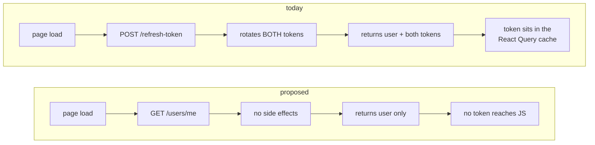

# 04. One session model: one shape, one bootstrap endpoint, cookie-only tokens

- **Rank: 8 / 10**
- **Side: Both**
- **Effort: Medium.** Touches three server controllers, the auth context, and every consumer of `user`

## Current picture

Three endpoints establish a session, and all three return a different shape into the same React Query cache key.

| Endpoint | Response `data` | Sets cookies? |
| --- | --- | --- |
| `POST /users/login` | `{ user, accessToken, refreshToken, loggedIn: true }` | yes |
| `POST /users/refresh-token` | `{ user }` | yes |
| `POST /users/register` | the created user document, unwrapped | **no** |

`AuthContextProvider` writes all three to `["currentUser"]`:

```ts
// contexts/AuthContextProvider.tsx
const { data: user, isLoading, isError } = useRefreshUser();   // shape: { user }
const login = useCallback((userData) => {
  queryClient.setQueryData(["currentUser"], userData);         // shape: whatever the caller passes
}, [queryClient]);
```

Three concrete bugs follow directly from this.

**1. `user.accessToken` exists only until the first reload.** `Logout.tsx:23` reads `user?.accessToken`. After login it is present; after any page refresh the cache is repopulated by `useRefreshUser`, which returns `{ user }` with no token, so it is `undefined`. The logout request then sends `Authorization: Bearer `, and works anyway, but only because `verifyJWT` checks the cookie first.

**2. Registration does not log the user in.** `registerUser` never calls `res.cookie()`. But `RegisterForm.tsx:51` does:

```tsx
onSuccess: (data: UserLoginAuthDataType) => { login(data); }
```

`data` is the full envelope `{statusCode, data, message, success}`, not even the inner user object. So after registering, the client sets `["currentUser"]` to an envelope, `useAuth().user` becomes that envelope, `user.user` is `undefined`, and the app renders as "logged in" with no session and no cookies. The next authenticated request 401s.

**3. Session bootstrap runs through token rotation.** `useRefreshUser` calls `POST /users/refresh-token` on every mount to answer "am I logged in?". That endpoint rotates the refresh token as a side effect. Consequences in `14.fix-refresh-token-rotation-race.md`.

Underneath all three: `client/src/constants/genericTypes.ts` types the context value as `AuthContextType`, but `login()` accepts `UserLoginAuthDataType` while `useRefreshUser` produces something else. The types describe an agreement the code does not keep.

The bootstrap path is where the cost shows up. Asking "am I logged in?" currently mutates session state:



Rotating on every page load is also what makes the race in `14.fix-refresh-token-rotation-race.md` fire during ordinary browsing rather than rarely.

## Proposed picture

### One shape

Every session-establishing endpoint returns exactly `{ user: PublicUser }`. Tokens are cookie-only and never appear in a body (`vulnerabilities/16`).

```ts
// shared contract
type SessionResponse = { user: PublicUser };

type PublicUser = {
  _id: string;
  username: string;
  fullname: string;
  email: string;          // own record only
  avatar: string | null;
  coverImage: string | null;
  createdAt: string;
};
```

### A dedicated bootstrap endpoint

Add `GET /api/v1/users/me`. It answers "who am I?" using the access token, with no side effects:

```ts
// server/src/controllers/userControllers/getMe.ts
export const getMe = asyncHandler(async (req, res) => {
  return res.status(200).json(new ApiResponse(200, { user: req.user }, "CURRENT SESSION"));
});
```

```ts
// server/src/routes/user.routes.ts
userRouter.route("/me").get(requireAuth, getMe);
```

This is close to the existing `GET /users/current-user`, which already does exactly this. Either rename that or keep it. The point is that the *client* must bootstrap from it rather than from `/refresh-token`.

The division of responsibility becomes:

| Endpoint | Purpose | Side effect |
| --- | --- | --- |
| `GET /users/me` | Is there a session? Who is it? | none |
| `POST /users/refresh-token` | Access token expired, so mint a new one | rotates both tokens |
| `POST /users/login` | Establish a session | issues both tokens |
| `POST /users/logout` | End a session | clears cookies, clears stored hash |

### Registration logs you in

```ts
// server/src/controllers/userControllers/registerUser.ts — at the end
const { newAccessToken, newRefreshToken } =
  await generateAccessAndRefreshTokens(String(userEntry._id));

const createdUser = await User.findById(userEntry._id).select(PRIVATE_USER_FIELDS);

return res
  .status(201)
  .cookie("accessToken", newAccessToken, accessTokenCookieOptions)
  .cookie("refreshToken", newRefreshToken, refreshTokenCookieOptions)
  .json(new ApiResponse(201, { user: createdUser }, "USER REGISTERED SUCCESSFULLY"));
```

Note the status code: the current code returns HTTP 201 with `new ApiResponse(200, ...)` in the body, so the envelope's `statusCode` disagrees with the HTTP status. See `16.consistent-response-envelope.md`.

The alternative, register and then require an explicit login, is defensible if you add email verification. Pick one; the current state (client thinks it logged in, server did not) is not a third option.

### Client: one source of truth

```tsx
// client/src/contexts/AuthContextProvider.tsx
const AuthContextProvider: React.FC<ChildrenProps> = ({ children }) => {
  const queryClient = useQueryClient();

  const { data, isLoading } = useQuery({
    queryKey: authKeys.session,
    queryFn: async (): Promise<SessionResponse | null> => {
      try {
        const res = await apiClient.get<ApiEnvelope<SessionResponse>>("/users/me");
        return res.data.data;
      } catch (error) {
        // 401 is a normal answer here: "not logged in", not a failure
        if (isAxiosError(error) && error.response?.status === 401) return null;
        throw error;
      }
    },
    staleTime: 5 * 60_000,
    retry: false,
    refetchOnWindowFocus: false,
  });

  const login = useCallback(
    (session: SessionResponse) => {
      queryClient.setQueryData(authKeys.session, session);
      queryClient.invalidateQueries({ queryKey: feedKeys.all });
    },
    [queryClient]
  );

  const logout = useCallback(() => {
    queryClient.setQueryData(authKeys.session, null);
    queryClient.clear();                 // drop every per-user cache, not just two keys
  }, [queryClient]);

  return (
    <authContext.Provider
      value={{ user: data?.user ?? null, login, logout, loading: isLoading }}
    >
      {children}
    </authContext.Provider>
  );
};
```

Three changes worth noting:

- **401 returns `null` instead of throwing.** Currently `useRefreshUser` throws on any non-OK response and the provider maps `isError` to `null`. That conflates "not logged in" (expected) with "the server is down" (not expected), and React Query retries and logs errors for something that is a normal state.
- **`logout()` calls `queryClient.clear()`.** The current implementation invalidates `["currentUser"]` and `["feed", 30]` only. Every other cached query, including watch history, liked content, playlists and dashboard stats, stays in memory and is served to whoever logs in next on the same browser session. That is a real data-leak-between-users bug.
- **`user` is `data?.user`**, so consumers get a `PublicUser`, not an envelope.

### Registration and login on the client

```tsx
// RegisterForm.tsx
registerMutate.mutate(formData, {
  onSuccess: (session) => { login(session); setFormData(resetForm); },
  onError: (err: Error) => setError(err.message),
});
```

with `useUserRegister` returning `data.data` (the `SessionResponse`) rather than the raw envelope. Since registration now sets cookies, `login(session)` is truthful.

## Migration order

1. Server: add `GET /users/me`; make register set cookies; drop tokens from the login body.
2. Client: change `useRefreshUser` → `useSession` pointing at `/users/me`.
3. Client: fix `Logout.tsx` and `useLogout` to stop reading `accessToken` (`vulnerabilities/16`).
4. Client: fix `RegisterForm.tsx` `onSuccess`/`onError`.
5. Client: remove `accessToken`/`refreshToken` from `responseTypes.ts`, and the compiler then finds any remaining reader.
6. Only then: refresh-token rotation changes (`14.fix-refresh-token-rotation-race.md`).

Steps 1-2 are the load-bearing ones. Do not reorder 6 before 2. The rotation fix assumes bootstrap no longer goes through `/refresh-token`.

## Interaction with other documents

- **Closes** `vulnerabilities/16.tokens-returned-in-response-body.md`.
- **Prerequisite for** `14.fix-refresh-token-rotation-race.md`. That document's grace-window design assumes `/refresh-token` is called only on 401, not on every page load.
- `06.single-http-client-with-interceptors.md` supplies `apiClient` and the 401-refresh-retry interceptor. The two are near-inseparable. The interceptor is what calls `/refresh-token` on 401, which is what lets bootstrap move to `/users/me`.
- `vulnerabilities/08.user-object-overexposure.md` and `vulnerabilities/09.email-addresses-exposed-on-public-endpoints.md` define `PublicUser` / `PRIVATE_USER_FIELDS` on the server. `PublicUser` here must match `PUBLIC_USER_FIELDS` there exactly.
- `vulnerabilities/17.auth-middleware-ignores-account-status.md` makes `requireAuth` return 403 for suspended accounts. The client's `getMe` handler above maps only 401 to `null`, so a 403 propagates as an error, which is correct: a suspended user should see an explanation, not a silent logout.
- `18.client-loading-gate-blocks-public-pages.md` deals with `loading` blocking the entire app while this query is in flight.

---

**Previous:** [03. Establish a security middleware baseline in app.ts](03.security-middleware-baseline.md) · **Next:** [05. Replace the `?userId=` pattern with an optionalAuth middleware](05.optional-auth-middleware.md) · **Up:** [Suggestions guide](index.md)
