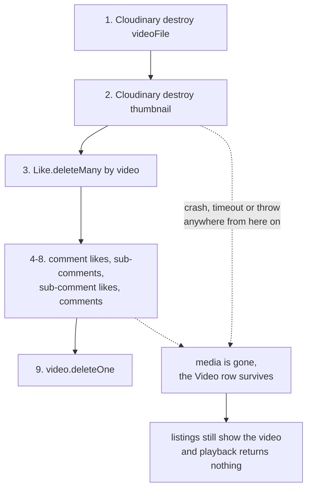

# 12. Make cascade deletes atomic

- **Rank: 7 / 10**
- **Side: Server**
- **Effort: Medium.** Requires a replica set; four handlers rewritten

## Current picture

Four handlers delete a document and its dependants with a sequence of independent operations. None is atomic and none can be rolled back.

### `deleteVideo.ts`: nine sequential operations

```ts
const deletedCloudinaryVideoFile = await deleteFromCloudinary(video.videoPublicId);
const deletedCloudinaryThumbnailFile = await deleteFromCloudinary(video.thumbPublicId);
if (!deletedCloudinaryVideoFile || !deletedCloudinaryThumbnailFile)
  throw new ApiError(400, "CLOUDINARY FILE DELETION FAILED");

await Like.deleteMany({ video: video._id });
const comments = await Comment.find({ video: video._id }).select("_id");
if (comments.length > 0) {
  await Like.deleteMany({ comment: { $in: commentIds } });
  const subComments = await Comment.find({ comment: { $in: commentIds } }).select("_id");
  if (subComments.length > 0) {
    await Like.deleteMany({ comment: { $in: subCommentIds } });
    await Comment.deleteMany({ _id: { $in: subCommentIds } });
  }
  await Comment.deleteMany({ _id: { $in: commentIds } });
}
const result = await video.deleteOne({ _id: videoId });
```

A crash or timeout at any point leaves the data half-deleted. Worse, **the Cloudinary deletion happens first**, so a failure after that point leaves a `Video` document whose `videoFile` URL points at a deleted asset. The video appears in listings and plays nothing.



The irreversible step runs first and the cheap, reversible one runs last. Reversing that order is most of the fix, and a transaction closes the rest.

Related: the video is not removed from any `Playlist.videos` array, so playlists keep dangling references. `getPlaylistById`'s `$lookup` quietly drops them, but `getUserPlaylists` does not filter, so counts stay wrong.

### `deleteTweet.ts`: same shape, same exposure

Eight operations, no transaction. Better than `deleteVideo` in that it has no external call in the middle.

### `deleteComment.ts`: non-atomic *and* incomplete

```ts
for (let com of nestedComments) {
  await Like.findOneAndDelete({ comment: comID });   // deletes ONE like, not all
  await com.deleteOne({ _id: comID });
}
const searchLike = await Like.findOneAndDelete({ comment: comment._id });   // ONE like
```

`findOneAndDelete` removes a single document. A comment with 40 likes loses one. See `vulnerabilities/20`. It is also an N+1 loop where two `deleteMany` calls would do.

### `deleteUser.ts`: disabled entirely

Wrapped in `if (0)`. See `vulnerabilities/06`.

## Proposed picture

### A reusable transaction helper

```ts
// server/src/utils/withTransaction.ts
import mongoose, { type ClientSession } from "mongoose";

export const withTransaction = async <T>(
  fn: (session: ClientSession) => Promise<T>
): Promise<T> => {
  const session = await mongoose.startSession();
  try {
    let result!: T;
    await session.withTransaction(async () => {
      result = await fn(session);
    });
    return result;
  } finally {
    await session.endSession();
  }
};
```

`session.withTransaction` handles commit, abort, and retry on transient errors. Do not hand-roll `startTransaction`/`commitTransaction`.

### `deleteVideo` rewritten

```ts
// server/src/services/video.service.ts
export const deleteVideoCascade = async (videoId: string, userId: Types.ObjectId) => {
  const video = await Video.findById(videoId);
  if (!video) throw new ApiError(404, "VIDEO NOT FOUND");
  if (!isOwner(video.owner, userId)) throw new ApiError(403, "NOT AUTHORIZED TO DELETE THIS VIDEO");

  // capture before deletion; used after commit
  const publicIds = [video.videoPublicId, video.thumbPublicId].filter(Boolean);

  await withTransaction(async (session) => {
    const commentIds = (
      await Comment.find({ video: video._id }).select("_id").session(session)
    ).map((c) => c._id);

    const subCommentIds = commentIds.length
      ? (await Comment.find({ comment: { $in: commentIds } }).select("_id").session(session))
          .map((c) => c._id)
      : [];

    const allCommentIds = [...commentIds, ...subCommentIds];

    if (allCommentIds.length) {
      await Like.deleteMany({ comment: { $in: allCommentIds } }, { session });
      await Comment.deleteMany({ _id: { $in: allCommentIds } }, { session });
    }
    await Like.deleteMany({ video: video._id }, { session });
    await View.deleteMany({ videoId: video._id }, { session });

    // dangling references the current code misses
    await Playlist.updateMany({ videos: video._id }, { $pull: { videos: video._id } }, { session });
    await User.updateMany({ watchHistory: video._id }, { $pull: { watchHistory: video._id } }, { session });

    await Video.deleteOne({ _id: video._id }, { session });
  });

  // External side effects AFTER commit. withTransaction may retry the callback,
  // and a Cloudinary delete is not idempotent-safe to run twice in that context.
  await Promise.allSettled(publicIds.map((id) => deleteFromCloudinary(id)));
};
```

Four things changed beyond atomicity:

1. **Cloudinary runs last.** If it fails, the database is already consistent and you have an orphaned asset, recoverable by a sweep job. The current order produces the opposite and worse failure.
2. **`Promise.allSettled`, not `Promise.all`.** One failed asset deletion should not fail the whole operation after the database has committed.
3. **`Playlist.videos` and `User.watchHistory` are cleaned up.** Neither is touched today.
4. **`View` documents are deleted.** Also not touched today; they have a 30-day TTL, so they eventually vanish, but they hold `ipAddress` and `userId` in the meantime.

### The prerequisite: a replica set

`session.withTransaction` requires MongoDB running as a replica set. This is not optional and it is the main cost of this change.

- **Atlas**: every tier including M0 free is a replica set. Nothing to do.
- **Local standalone `mongod`**: transactions throw `Transaction numbers are only allowed on a replica set member or mongos`. Convert to a single-node replica set:

```bash
mongod --replSet rs0 --dbpath /your/path
mongosh --eval 'rs.initiate()'
# connection string becomes: mongodb://127.0.0.1:27017/?replicaSet=rs0
```

If you cannot, degrade gracefully rather than crashing:

```ts
export const withTransaction = async <T>(fn: (s?: ClientSession) => Promise<T>): Promise<T> => {
  const supportsTransactions = mongoose.connection.db
    ?.admin && (await mongoose.connection.db.admin().replSetGetStatus().catch(() => null)) !== null;

  if (!supportsTransactions) {
    logService.warn("transactions unavailable — running without atomicity");
    return fn(undefined);
  }
  // ... transactional path ...
};
```

Cache that check at startup rather than probing per call.

### Alternative if transactions are not viable

Soft-delete: mark `deletedAt` on the parent, filter it out of every read, and let a background job do the physical cascade.

```ts
videoSchema.add({ deletedAt: { type: Date, default: null, index: true } });
// every read filter gains: deletedAt: null
```

The delete becomes one atomic `updateOne`, and the content disappears from the product immediately.

| | Transactional cascade | Soft delete |
| --- | --- | --- |
| Atomic | yes, one commit | yes, one `updateOne` |
| Infrastructure needed | a replica set | none |
| Ongoing read-path burden | none | every read filter, forever |
| Cost of forgetting one | not possible | deleted content resurfaces |
| Storage reclaimed | immediately | only when the sweep job runs |
| Fit for this codebase | **recommended** | risky |

The last row is the deciding one. `isPublished` is already filtered inconsistently across six read paths (`vulnerabilities/11`), so a scheme whose correctness depends on never forgetting a filter is a scheme this codebase has already shown it will get wrong. Transactions are the safer choice here.

## Also fix: nesting depth

Every delete path assumes exactly two comment levels (comment → reply). The schema allows arbitrary depth via the self-referencing `comment` field, and `addCommentToComment` does not restrict it. A reply to a reply to a comment survives its grandparent's deletion.

Either enforce the limit on write:

```ts
// addCommentToComment
const parent = await Comment.findById(comment_ID).select("comment");
if (!parent) throw new ApiError(404, "COMMENT NOT FOUND");
if (parent.comment) throw new ApiError(400, "CANNOT REPLY TO A REPLY");
```

or make the cascade recursive. Enforcing the limit is simpler and matches what the UI renders.

## Interaction with other documents

- **Fixes the `deleteComment` half of** `vulnerabilities/20.silent-authorization-failures.md`. That document shows the minimal `deleteMany` patch; this replaces it. **Do not apply both** to the same handler.
- `vulnerabilities/06.account-deletion-is-a-noop.md` uses `withTransaction` from this document. That document hand-rolls `session.withTransaction`; use the helper here instead.
- **Depends on** `07.database-indexes-and-unique-constraints.md`. The cascade filters on `owner`, `video`, `comment`, `tweet`. Without those indexes each delete triggers several collection scans inside a transaction, which holds locks longer.
- `08.service-layer-extraction.md`. These cascades belong in service modules, not controllers. This document's `deleteVideoCascade` is written as a service function for that reason.
- `19.cloudinary-asset-lifecycle.md` covers the orphaned-asset sweep that the post-commit `allSettled` implies.

---

**Previous:** [11. Structured logging: redaction, request IDs, correct levels](11.structured-logging-with-redaction.md) · **Next:** [13. Add a test suite, starting with auth and authorization](13.add-a-test-suite.md) · **Up:** [Suggestions guide](index.md)
