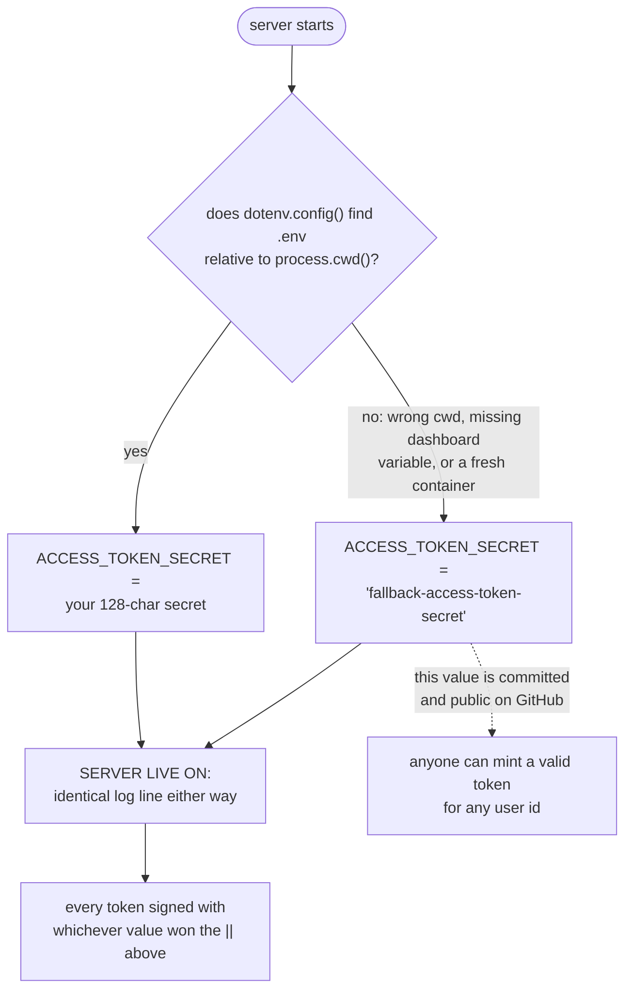

# 01. Hardcoded fallback JWT secrets

- **Rank: 9 / 10**
- **Side: Server**
- **Category:** Broken authentication / secrets management
- **Location:** `server/src/utils/dotenvHelper.ts:43-50`

## The issue

`dotenvHelper.ts` builds the `env` object by reading `process.env` with `||` fallbacks. For the two JWT signing secrets the fallbacks are literal strings committed to the repository:

```ts
ACCESS_TOKEN_SECRET:
  process.env.ACCESS_TOKEN_SECRET || "fallback-access-token-secret",
REFRESH_TOKEN_SECRET:
  process.env.REFRESH_TOKEN_SECRET || "fallback-refresh-token-secret",
```

Your actual `.env` has strong 128-character secrets, and `.env` is correctly gitignored. That is not the problem. The problem is what happens the moment `.env` is *not* loaded.

`dotenv.config()` is a no-op that reports no error when the file is absent. It resolves `.env` relative to `process.cwd()`, not relative to the source file. So the secrets silently become the public fallback values in every one of these situations:

- The app is started from a different working directory (`node server/dist/index.js` from the repo root instead of from `server/`).
- The build is deployed to a host where the environment variables were never configured, or where one was renamed/typo'd in the dashboard.
- A container is built without the env file and without `--env-file` / injected env.
- Someone runs the compiled `dist/` output on a fresh machine to test something.

In all those cases the server boots normally, logs `SERVER LIVE ON:`, and issues tokens signed with a secret that is published in your GitHub repository.



The two paths are indistinguishable from the outside. There is no log line, no warning, and no health-check field that tells you which secret is in use.

## Why it matters

The consequence is total authentication bypass, not degraded security. `server/src/models/user.model.ts:75-95` signs the access token with a payload of `{_id, email, username, fullname}`. `server/src/middleware/auth.middleware.ts:28-38` verifies that token and then loads `User.findById(decodedToken._id)` and attaches it as `req.user`. Every ownership check in the codebase (`isOwner`, `owner: req.user._id` filters) trusts `req.user`.

So an attacker who knows the secret does this:

```js
jwt.sign(
  { _id: "<any user id>", email: "x@x.com", username: "x", fullname: "x" },
  "fallback-access-token-secret",
  { expiresIn: "15m" }
)
```

and sends it as the `accessToken` cookie. They are now that user. They pick which one by browsing `/api/v1/users/profile/:userId` (see `08.user-object-overexposure.md`, which hands out user IDs to anonymous callers). They can delete that user's videos, post as them, change their email, and read their watch history.

The attack requires no interaction with the victim and leaves no trace distinguishable from a normal login.

The same pattern makes several other fallbacks dangerous, though less catastrophically:

- `CORS_ORIGIN: process.env.CORS_ORIGIN || "*"`. `server/src/app.ts:29` throws if the list is empty, but `"*"` is a non-empty list of one entry, so the app boots with an origin allowlist containing the literal string `"*"`, which matches nothing. Every browser request from your real frontend then fails CORS. A confusing outage rather than a breach, but it is a silent misconfiguration that survives startup.
- `MONGODB_COMPASS_CONNECTION_STRING || "mongodb://connection-string-not-found"`. Fails loudly, which is fine.
- `GMAIL_PASSWORD: String(process.env.GMAIL_PASSWORD)`. Produces the literal string `"undefined"` when unset, which is then sent to an SMTP server as a password.

## The fix

Replace value-level fallbacks with a validated config module that throws at boot. A secret must never have a default.

```ts
// server/src/config/env.ts
import dotenv from "dotenv";
import path from "path";

// resolve relative to this file, not to process.cwd()
dotenv.config({ path: path.resolve(__dirname, "../../.env") });

const required = (key: string, minLength = 1): string => {
  const value = process.env[key];
  if (!value || value.length < minLength) {
    throw new Error(
      `FATAL: environment variable ${key} is missing or too short ` +
      `(need >= ${minLength} chars). Refusing to start.`
    );
  }
  return value;
};

const optional = <T>(key: string, fallback: T, parse: (v: string) => T): T => {
  const value = process.env[key];
  return value === undefined ? fallback : parse(value);
};

export const env = {
  NODE_ENV: optional("NODE_ENV", "development", String),
  PORT: optional("PORT", 3001, Number),

  // no defaults — the process must not start without these
  MONGODB_URI: required("MONGODB_COMPASS_CONNECTION_STRING"),
  DB_NAME: required("DB_NAME"),
  ACCESS_TOKEN_SECRET: required("ACCESS_TOKEN_SECRET", 32),
  REFRESH_TOKEN_SECRET: required("REFRESH_TOKEN_SECRET", 32),
  CORS_ORIGIN: required("CORS_ORIGIN"),
  CLOUDINARY_API_KEY: required("CLOUDINARY_API_KEY"),
  CLOUDINARY_API_SECRET: required("CLOUDINARY_API_SECRET"),
  CLOUDINARY_CLOUD_NAME: required("CLOUDINARY_CLOUD_NAME"),

  // safe to default — behaviour, not credentials
  ACCESS_TOKEN_EXPIRY: optional("ACCESS_TOKEN_EXPIRY", "15m", String),
  REFRESH_TOKEN_EXPIRY: optional("REFRESH_TOKEN_EXPIRY", "7d", String),
  LOG_LEVEL: optional("LOG_LEVEL", "info", String),
} as const;
```

Two additional guards worth adding:

1. **Assert the two secrets differ.** If `ACCESS_TOKEN_SECRET === REFRESH_TOKEN_SECRET`, a refresh token becomes a valid access token and vice versa. Add `if (env.ACCESS_TOKEN_SECRET === env.REFRESH_TOKEN_SECRET) throw new Error(...)`.
2. **Import the config module first in `index.ts`**, before anything else, so a misconfiguration fails before a port is bound and before Mongo is touched.

### After you deploy this

Rotate both secrets. Any token minted while a fallback secret was possibly in effect should be considered compromised. Rotating invalidates every session, which is the correct outcome. Users re-log-in once.

## Interaction with other documents

- The constructive, full version of this change is `suggestions/01.fail-fast-env-config.md`. That document is the design; this one is the vulnerability. Implement the suggestion and this closes.
- Rotating secrets interacts with `10.password-change-does-not-revoke-sessions.md`. Both are about token invalidation. The `tokenVersion` mechanism proposed there gives you per-user revocation; secret rotation gives you global revocation. They are complementary, not alternatives.
- Do **not** "fix" this by moving the secrets into `constants.ts` or any other tracked file. That is strictly worse than the current state.

---

**Previous:** [Audit index](../00.INDEX.md) · **Next:** [02. Plaintext passwords written to application logs](02.plaintext-passwords-written-to-logs.md) · **Up:** [Vulnerabilities guide](index.md)
