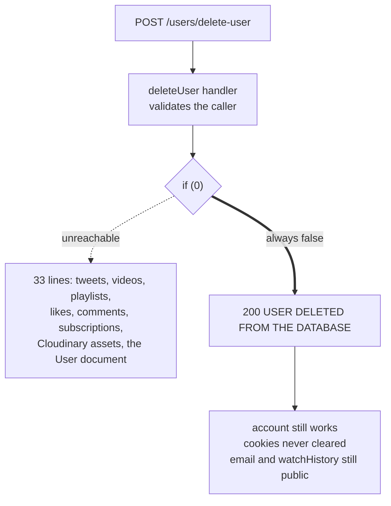

# 06. Account deletion silently does nothing

- **Rank: 8 / 10**
- **Side: Both (server does nothing, client reports success)**
- **Category:** Broken access control / data retention / integrity of a user-facing guarantee
- **Location:** `server/src/controllers/userControllers/deleteUser.ts:35-71`, `client/src/hooks/CRUD-hooks/useDeleteUser.ts`, `client/src/components/setting/DeleteUser.tsx`

## The issue

The entire body of `deleteUser` is disabled by a constant-false guard:

```ts
const deleteUser = asyncHandler(async (req, res) => {
  if (!req.user || !req.user?._id) throw new ApiError(401, "UNAUTHENTICATED REQUEST");

  const userId = req.user._id;
  if (!isValidObjectId(userId)) throw new ApiError(400, "INVALID USER_ID");

  if (0) {
    // ... every delete: tweets, videos, playlists, likes, comments,
    //     subscriptions, and finally the User document itself ...
  }

  return res
    .status(200)
    .json(new ApiResponse(200, {}, "USER DELETED FROM THE DATABASE"));
});
```

`if (0)` is never entered. The handler validates the caller, deletes nothing, and returns HTTP 200 with the message **"USER DELETED FROM THE DATABASE"**.



The UI shows a success message, so from the user's side the account is gone. Nothing on the server agrees.

TypeScript does not flag this: `if (0)` is a legal narrowing-free condition, and the block still type-checks. ESLint's `no-constant-condition` would catch it, but the server has no ESLint config at all (only `client/eslint.config.js` exists).

## Why it matters

This is not a subtle bug. It is a feature that reports success while doing the opposite of what it claims, and both ends of the stack cooperate to make the lie convincing.

The client believes it:

```ts
// client/src/hooks/CRUD-hooks/useDeleteUser.ts
const { data } = await axios.post(`${URL}/users/delete-user`, {}, { withCredentials: true });
if (!data) throw new Error("ERROR IN REQUEST TO DELETE USER");
return data.data;
```

`data` is the 200 envelope, so the mutation resolves successfully, the UI runs its success path, and the user is shown confirmation that their account is gone.

The consequences:

1. **The account still works.** The `User` document, the password hash, and the `refreshToken` field are untouched. The user's cookies are not even cleared, unlike `deactivateUser`, which does call `clearCookie`. So the "deleted" user remains fully logged in and can keep using the app until their token expires.

2. **All their content stays public.** Videos, tweets, comments, and likes remain visible and attributed to them. Someone who deleted their account to remove content from the internet has been told it is gone while it is still being served on the feed.

3. **Their personal data is retained indefinitely.** Email address, full name, avatar, cover image, and their entire watch history stay in the database and remain retrievable, including by anonymous callers, via `GET /api/v1/users/profile/:userId`, which returns the whole document (see `08.user-object-overexposure.md`).

4. **It is a deletion-request failure.** Under GDPR Article 17 and comparable regimes, "delete my account" is a legal obligation with a response deadline, and answering it with a success message you did not act on is materially worse than having no delete feature at all. You currently have no record of which users requested deletion, so you cannot even remediate retroactively.

You told me this deployment has demo data and no real users yet. That is why this is 8 rather than 9. The harm is currently hypothetical. But this is precisely the kind of thing that does not get revisited before launch, because the feature *appears* to work end-to-end in manual testing.

## Secondary problem: the disabled code is also wrong

Do not simply delete the `if (0)`. The code inside it has real defects:

```ts
const delUser = await User.findOneAndDelete(userId);   // line 65
```

`findOneAndDelete` takes a *filter*, not an ID. Passing an ObjectId where a filter object is expected does not do what it looks like it does. It should be `User.findByIdAndDelete(userId)` or `User.deleteOne({ _id: userId })`.

Further issues in that block:
- **Not atomic.** Eight sequential deletes with no transaction. A crash midway leaves the account half-deleted: content gone, user record present, or vice versa.
- **Every guard is dead.** `const tweets = await Tweet.find(...); if (!tweets) throw ...`. `find()` resolves to `[]` when nothing matches, and `[]` is truthy. None of those `if (!x) throw` lines can ever fire.
- **Cloudinary assets are never removed.** Avatars, cover images, video files, and thumbnails stay in Cloudinary and keep being billed. The commented-out reference implementation at the bottom of the file gets this right; the live code does not.
- **Nothing deletes `View` documents** (`view.model.ts`) which carry `userId` and `ipAddress`. Those are exactly the records a deletion request is about. The TTL index expires them after 30 days, but that is not deletion-on-request.

## The fix

Decide first: **hard delete or soft delete?** They lead to different implementations, and picking one is a prerequisite for the code below.

- **Hard delete.** The row and all owned content are removed. Honest, simple to explain, and what "delete my account" implies. But it orphans other users' data: comments referencing a deleted commenter, playlists containing deleted videos.
- **Soft delete / anonymise.** The `User` document is retained with identifying fields scrubbed (`email`, `fullname`, `avatar` nulled; `username` replaced with `deleted_user_<random>`), and content is either removed or reattributed to a tombstone. This is what YouTube and most platforms actually do, because it keeps referential integrity intact.

I recommend **anonymise-and-purge**: scrub the identity, hard-delete the content the user created, keep a minimal tombstone so foreign keys resolve. It satisfies a deletion request (no personal data remains) without producing dangling references.

```ts
// server/src/controllers/userControllers/deleteUser.ts
import mongoose from "mongoose";
import crypto from "crypto";

export const deleteUser = asyncHandler(async (req, res) => {
  const userId = req.user!._id;

  // Collect Cloudinary IDs before the documents are gone.
  const user = await User.findById(userId).select(
    "avatarPublicId CoverImagePublicId"
  );
  if (!user) throw new ApiError(404, "USER NOT FOUND");

  const videos = await Video.find({ owner: userId }).select(
    "videoPublicId thumbPublicId"
  );
  const publicIds = [
    user.avatarPublicId,
    user.CoverImagePublicId,
    ...videos.flatMap((v) => [v.videoPublicId, v.thumbPublicId]),
  ].filter(Boolean) as string[];

  const session = await mongoose.startSession();
  try {
    await session.withTransaction(async () => {
      const videoIds = videos.map((v) => v._id);

      // content the user created
      await Tweet.deleteMany({ owner: userId }, { session });
      await Video.deleteMany({ owner: userId }, { session });
      await Playlist.deleteMany({ owner: userId }, { session });
      await Comment.deleteMany({ owner: userId }, { session });
      await Like.deleteMany({ likedBy: userId }, { session });
      await Subscription.deleteMany(
        { $or: [{ channel: userId }, { subscriber: userId }] },
        { session }
      );
      await View.deleteMany({ userId }, { session });

      // content attached to the user's videos, now orphaned
      await Comment.deleteMany({ video: { $in: videoIds } }, { session });
      await Like.deleteMany({ video: { $in: videoIds } }, { session });

      // anonymised tombstone
      await User.updateOne(
        { _id: userId },
        {
          $set: {
            username: `deleted_${crypto.randomBytes(8).toString("hex")}`,
            email: `deleted_${crypto.randomBytes(8).toString("hex")}@invalid.local`,
            fullname: "Deleted User",
            password: crypto.randomBytes(32).toString("hex"), // unusable
            avatar: null,
            coverImage: null,
            avatarPublicId: null,
            CoverImagePublicId: null,
            watchHistory: [],
            refreshToken: "",
            isDeleted: true,
            deletedAt: new Date(),
          },
        },
        { session }
      );
    });
  } finally {
    await session.endSession();
  }

  // outside the transaction: external side effects must not be retried by it
  await Promise.allSettled(publicIds.map((id) => deleteFromCloudinary(id)));

  return res
    .status(200)
    .clearCookie("accessToken", httpOptions)
    .clearCookie("refreshToken", httpOptions)
    .json(new ApiResponse(200, { deleted: true }, "ACCOUNT DELETED"));
});
```

Three things to note about this implementation:

- **Cookies are cleared.** The current handler does not, so a "deleted" user stays logged in. `deactivateUser` gets this right; copy that behaviour.
- **Cloudinary cleanup happens after the transaction commits**, not inside it. External HTTP calls inside a transaction that may be retried will double-execute.
- **`isDeleted` must then be honoured everywhere.** Add it to the `$match` filters that already check `isDeactivated`/`isSuspended`, in `searchUserText.controller.ts`, `homepage.controller.ts`, `getUserChannelProfile.ts`, and `feed.controller.ts`. A tombstone that still shows up in search is not a deletion.

### Requirements on the route

```ts
// server/src/routes/user.routes.ts
userRouter.route("/delete-user").delete(requireAuth, authLimiter, deleteUser);
```

Change `POST` to `DELETE`. The code comment already says this was the intent, and it removes the route from the CSRF-forgeable set described in `03.no-csrf-protection-with-cross-site-cookies.md`. Update `client/src/hooks/CRUD-hooks/useDeleteUser.ts` to match.

Also require password re-entry for this action. Account deletion is irreversible and currently needs nothing but a session cookie.

### Transactions require a replica set

`session.withTransaction` needs MongoDB running as a replica set. Atlas provides this on every tier including free. A standalone `mongod` does not, and the call will throw. If you are on a standalone local instance for development, either run it as a single-node replica set or gate the transaction behind a capability check.

## Interaction with other documents

- `suggestions/12.atomic-cascade-deletes.md` generalises the transaction pattern here to `deleteVideo`, `deleteTweet`, and `deleteComment`, which have the same non-atomic multi-step shape. Implement that document's helper and use it here rather than hand-rolling `withTransaction` in each controller.
- `suggestions/19.cloudinary-asset-lifecycle.md` covers why `avatarPublicId` and `CoverImagePublicId` are currently **never populated**. `updateUserAvatar` and `updateUserCoverImage` save the URL but not the public ID. Until that is fixed, the Cloudinary cleanup above has nothing to delete for avatars. Fix that one first or this cleanup is partially inert.
- `20.silent-authorization-failures.md` describes the same "returns 200 for an operation that did not happen" pattern in `deletePlaylist`. Same root cause: not checking the result of a Mongo write.
- `suggestions/13.add-a-test-suite.md`. An integration test asserting `User.findById(id)` is null (or anonymised) after `DELETE /users/delete-user` would have caught this immediately, and is the single highest-value test to write first.

---

**Previous:** [05. No rate limiting on any endpoint](05.no-rate-limiting-on-any-endpoint.md) · **Next:** [07. Unauthenticated write to any user's watch history](07.unauthenticated-write-to-any-users-watch-history.md) · **Up:** [Vulnerabilities guide](index.md)
